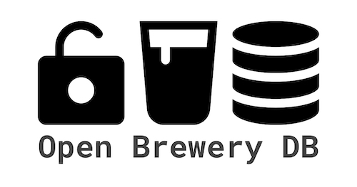

# 🍻 Official Open Brewery DB REST API Server




The Open Brewery DB API server is a Ruby on Rails app connected to a PostgreSQL DB server served at https://api.openbrewerydb.org.

[Documentation](https://www.openbrewerydb.org/)

## 📦 Dependencies

- Ruby 3.1.1
- PostgreSQL 14.2
- Elastic Search (See [Searchkick's](https://github.com/ankane/searchkick) [Getting Started](https://github.com/ankane/searchkick#getting-started) section.) _Note: Elastic Search is likely to be removed in the future._

## 🚀 Getting Started

### Local Environement

1. Clone the repo `$ git clone https://github.com/openbrewerydb/openbrewerydb-rest-api`
2. Run `bundle install`
3. Run `bundle exec rails db:setup`
4. Run database import. See [Data Import Task](#Data-Import-task)
5. Run `bundle exec rails s`

The server will be running at `http://localhost:3000`

#### Updating

**NOTE: Don't forget to use `bundle lock --add-platform x86_64-linux` after updating bundle!**

### Database Expectations

There are some assumptions for the local PostgreSQL service configuration.

- Host is `localhost` or `127.0.0.1`
- User is blank (i.e. it is the current system user)
- Password is blank

All of these settings can be overwritten by setting environment variables in `.env`:

- `POSTGRES_USER`
- `POSTGRES_PASSWORD`
- `POSTGRES_HOST`

See `config/database.yml` for configuration.

## Data Import task

Using Rake, we can import the brewery data with a simple command.

`rake breweries:import:breweries`

This command will update your existing database in the development environment with new breweries. We also allow you to set environment variables to determine how to run the task.

- `RAILS_ENV=[development, test]`
- `TRUNCATE=[true, false]`
- `DRY_RUN=[true, false]`

### Prerequisites

You will need to have your postgresql server running as well as the ElasticSearch container. ElasticSearch is required for the autocompletion and fuzzy searching functionalities.

```shell
#start postgresql server
sudo service postgresql start

#pull and start elasticsearch container
docker pull docker.elastic.co/elasticsearch/elasticsearch:7.12.1
docker run -p 9200:9200 -p 9300:9300 -e "discovery.type=single-node" docker.elastic.co/elasticsearch/elasticsearch:7.12.1
```

Additionally, these commands will not run Geocode or index fields with `searchkick`. These have their own rake tasks and will need to be run manually if you would like to use their functionality.

```shell
#geocode
rake geocode:all CLASS=Brewery RAILS_ENV=[development, test] BATCH=100

#searchkick
rake searchkick:reindex CLASS=Brewery RAILS_ENV=[development, test]
```

> Note! The geocode task takes an extraordinary amount of time. Do not run this task unless you require it. You should also use the BATCH env so you do not run out of memory.

### Update

Updating is the default task. This should be run if you wish to only update your existing database.

### Fresh import

This option will truncate your breweries table to make sure it's clean and then add all breweries. This will also bypass all validations as it's inserting by direct SQL commands.

`rake breweries:import:breweries TRUNCATE=true RAILS_ENV=[development, test]`

### Adding data manually

Importing data can also be done manually if you grab the data from [openbrewerydb](https://github.com/openbrewerydb/openbrewerydb).

- Open postgresql shell with `psql <your user>`
- `\c openbrewerydb_development` to connect to the database
- Make sure the `breweries` table exists. `\dt`
- Copy the data to the table: `\copy breweries(obdb_id,name,brewery_type,street,address_2,address_3,city,state,county_province,postal_code,website_url,phone,created_at,updated_at,country,longitude,latitude,tags) from '<path to CSV data file>' DELIMITER ',' CSV HEADER`
- Run `SELECT * FROM breweries LIMIT 10;` to make sure data loaded

### Running Tests

`bundle exec rake` or `bundle exec rspec`

## 🤝 Contributing

For information on contributing to this project, please see the [contributing guide](CONTRIBUTING.md) and our [code of conduct](CODE_OF_CONDUCT.md).

## 🔗 Related

- [Open Brewery DB Website & Documentation](https://github.com/chrisjm/openbrewerydb-gatsby)
- [Open Brewery DB Dataset](https://github.com/openbrewerydb/openbrewerydb)

## 👾 Community

- [Join the Newsletter](http://eepurl.com/dBjS0j)
- [Join the Discord](https://discord.gg/SHtpdEN)

## 📫 Feedback

Any feedback, please [email me](mailto:chris@openbrewerydb.org).

Cheers! 🍻
